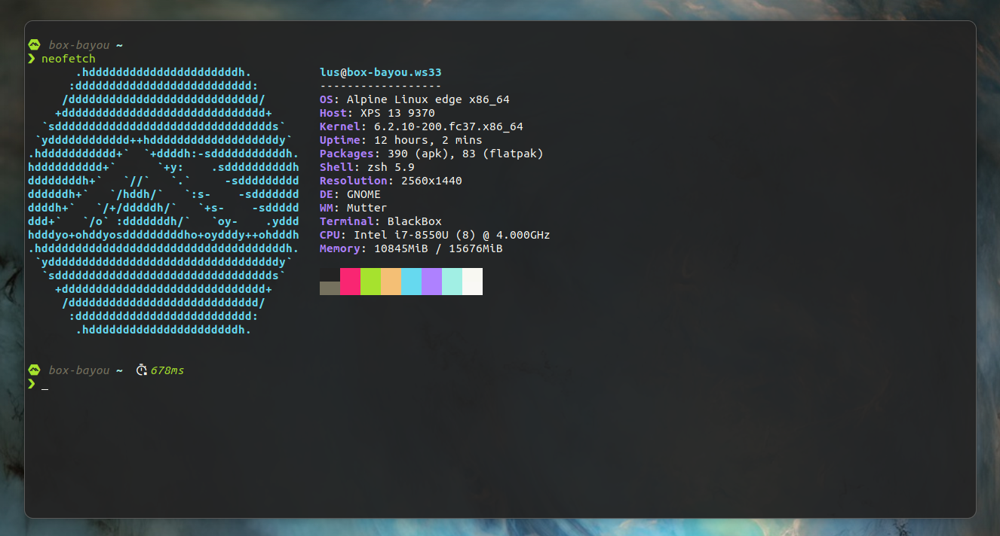

# box-bayou

This is my take on a Toolbox / Distrobox container based on the ideas of [ublue-os/boxkit](https://github.com/ublue-os/boxkit).

The goal of this project is to have a companion distrobox container for
my custom [ublue-bayou](https://github.com/tepene/ublue-bayou) Fedora Silverblue
setup. It's my default terminal for daily usage.



## Tools

The container is based on the latest Alpine image from the [Toolbx Community Images](https://github.com/toolbx-images/images)
and and is spruced up with the following configuration.

### Installed in the container

The following tools are shipped with the container:

<!-- markdownlint-disable MD013 -->

- [chezmoi](https://www.chezmoi.io/) for dotfile management
- [cosign](https://github.com/sigstore/cosign) to sign OCI containers (and other artifacts) using Sigstore
- [direnv](https://direnv.net/) to unclutter your `.profile`
- [helix](https://helix-editor.com/) as post-modern text editor
- [jq](https://stedolan.github.io/jq/) JSON command-line processor
- [neofetch](https://github.com/dylanaraps/neofetch) eye candy system information
- [pipx](https://pypa.github.io/pipx/) to run python applications in isolated environments
- [poetry](https://python-poetry.org/) for python `venv` management
- [python-3](https://www.python.org/) to run python applications
- [starship](https://starship.rs/) cross-shell prompt for that <3
- [yq](https://mikefarah.gitbook.io/yq/) YAML command-line processor
- [zsh](https://www.zsh.org/) as the default shell

<!-- markdownlint-enable MD013 -->

### Mapped from Host OS

The following tools are symlinked from the host system:

- [btop++](https://github.com/aristocratos/btop)
- [flatpak](https://www.flatpak.org/)
- [just](https://github.com/casey/just)
- [podman](https://podman.io/)
- [rmp-ostree](https://rpm-ostree.readthedocs.io/en/stable/)

## Usage

### Creation

### With Distrobox

```sh
distrobox create -i ghcr.io/tepene/box-bayou:latest -n box-bayou
distrobox enter box-bayou
```

### With Toolbox

```sh
toolbox create -i ghcr.io/tepene/box-bayou:latest -c box-bayou
toolbox enter box-bayou
```

## Initial Configuration

Once the box is running you can set the initial configuration with the `setup.sh`
script.

You have the following options:

### glitter

Use this option for all glitter and sparkle.

`/opt/scripts/setup.sh glitter`

This will set the needed file permissions for the `/opt` directory, change
the default shell to ZSH and configure ZSH and Starship with an initial
configuration. And just to be sure, if you already have a ZSH and / or Starship
configuration, the script will create a backup of the files `~/.zshrc` and
`~/.config/starship.toml`. (better safe than sorry...)

### boring

Use this option if you just want to set ZSH as the default shell but no default
configuration.

`/opt/scripts/setup.sh boring`

This will set the needed file permissions for the `/opt` directory and change
the default shell to ZSH.

### preserve

Use this option if you already have a ZSH and / or Starship configuration which
you don't want to mess up.

`/opt/scripts/setup.sh preserve`

This will only set the needed file permissions for the `/opt` directory.

## Verification

These images are signed with sisgstore's [cosign](https://docs.sigstore.dev/cosign/overview/).
You can verify the signature by downloading the `cosign.pub` key from this repo
and running the following command:

`cosign verify --key cosign.pub ghcr.io/tepene/box-bayou:latest`

If you're forking this repo you should [read the docs](https://docs.github.com/en/actions/security-guides/encrypted-secrets)
on keeping secrets in github. You need to [generate a new keypair](https://docs.sigstore.dev/cosign/overview/)
with cosign. The public key can be in your public repo (your users need it to check
the signatures), and you can paste the private key in Settings -> Secrets -> Actions.
